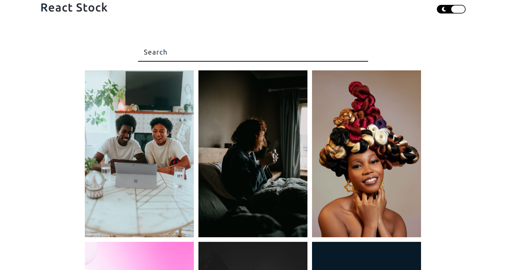

# PhotoStock app

## This project is under development.

  

### About

This is Photo Stock app that allows the user to find photos about specific search terms. You can find many photos and see who is the creator of this photo. You can also download the photo if you are interested.

The app uses Unsplash API to interact with the backend.

### Features

- It allows the user to search for specific photo.
- it shows information about the photo.
- it allows the user to download the photo.
- it can change to dark mode.

### Built using

For the past few months I have been working with React, so this is what I am using to build this app

- ReactJs: Front-end framework
- Redux: State management

### Feedback

Like I mentioned earlier this project is under development, if you find and see some issue please open one issues or if you need/want a feature you can also make a request for said feature :)

### Running locally

1. Open a terminal and clone the repo using the following command: `git clone`
2. Install the dependencies using the following command: `npm i`
3. and run the following command: `npm start`
